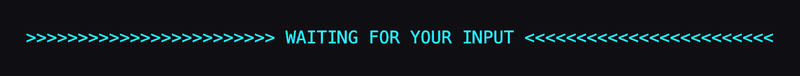

# mlg87 omp plugins

An [omp](https://github.com/oh-my-pi/pi-coding-agent) plugin marketplace.

```
/marketplace add mlg87/omp-plugins
/marketplace discover mlg87
```

| Plugin | Description |
|---|---|
| [`ask-pulse`](plugins/ask-pulse) | Pulsing dayglo banner above the `ask` dialog so a waiting agent is impossible to miss. |
| [`obvi-plan`](plugins/obvi-plan) | Tints the terminal background (lilac by default) while plan mode is active, and restores your theme when you leave it. |




Install one:

```
/marketplace install ask-pulse@mlg87
/marketplace install obvi-plan@mlg87
```

## Local development

```
/marketplace add ./omp-plugins
/marketplace install --force ask-pulse@mlg87
/marketplace install --force obvi-plan@mlg87
```

Each plugin is a self-contained package under `plugins/<name>` with its own `package.json`,
lockfile, lint, typecheck, and tests; run `bun install` and the checks from that directory.

A release bumps the plugin's `version` in its `package.json` and in both catalog files together:
`omp plugin upgrade` compares catalog versions, so users only see a release once the catalog says so.

The catalog is published at both `.omp-plugin/marketplace.json` (read by omp) and
`.claude-plugin/marketplace.json` (Claude Code compatible fallback); keep them in sync.
