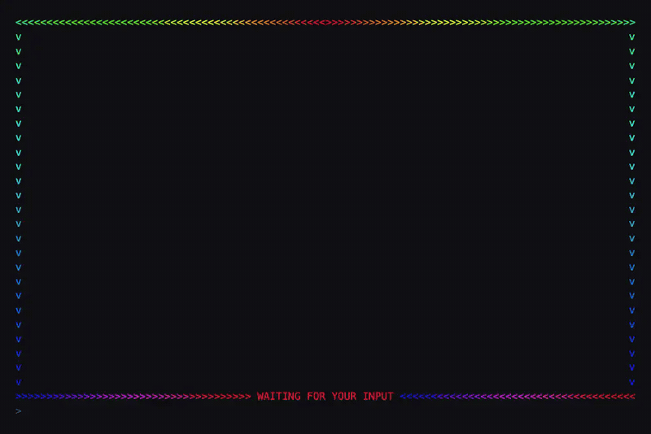

# ask-pulse

An animated banner that makes a waiting omp agent impossible to miss. When the agent finishes a turn
or asks you a question, ask-pulse frames its last reply and the input box in a flowing rainbow (or
your own colors), so across a wall of terminal panes you can tell at a glance which one needs you.




<sub>Every preview is rendered from the real components by `scripts/render-preview.ts`, so it cannot drift from what the extension draws.</sub>

## What you get

ask-pulse has two modes, and both clear the moment you submit your next message.

**Ask mode** runs for the whole life of an `ask` dialog:

- A rounded box titled `WAITING FOR YOUR INPUT` sits directly on top of the dialog.
- It shows the pending questions, including each question's `[header]` if it has one.
- Long text is word-wrapped to the box width, up to 3 lines per question.
- At most 3 questions are shown, followed by "…and N more questions on the dialog below".

**Idle mode** runs whenever the agent yields the turn, including a plain answer that never called `ask`:

- **Above the input box:** a caret rule, `^^^^ WAITING FOR YOUR INPUT ^^^^`.
- **Above the agent's last reply:** a full-width line of `v` carets, added to the transcript. It
  stays dim while the agent is working and animates once the turn is yours.
- **When the next reply starts:** the previous divider is removed if it is still on screen. If
  the reply was taller than the screen, the divider has already scrolled into terminal history
  and is left there as a dim line, because removing rows from scrollback would corrupt it.

Both modes animate by default with a **rainbow** that flows along the frame toward the text.
Alternatively, give it one or two colors and it **fades** between them with a caret wave that
sweeps in and bounces back. After 30 minutes without input it stops animating and holds still, so
an unattended pane is not redrawn 30 times a second overnight.

## Install

```
/marketplace add mlg87/omp-plugins
/marketplace install ask-pulse@mlg87
```

Restart the omp session; omp loads extension modules only at startup. Skip the first line if you
already added the `mlg87` marketplace for another plugin.

To receive updates automatically at startup (omp's default only logs that one exists):

```
omp config set marketplace.autoUpdate auto
```

Without the marketplace, you can copy `src/ask-pulse.ts` into `~/.omp/agent/extensions/` instead.

## Commands

`/ask-pulse` with no arguments is the same as `/ask-pulse show`.

| Command | Effect |
|---|---|
| `/ask-pulse show` | Print the active appearance, cycle length, idle and hold settings, and which config sources are in effect. |
| `/ask-pulse color rainbow` | Flowing rainbow (the default). |
| `/ask-pulse color <first> [second]` | Fade between two colors. With one color, it fades against a 24%-brightness version of itself. Takes hex (`#ff10f0`, `ff10f0`, `#f1f`) or a preset. |
| `/ask-pulse period <ms>` | Length of one pulse/flow cycle in milliseconds (minimum 100, default 2000). |
| `/ask-pulse idle on\|off` | Turn idle mode (the rule and divider on every finished turn) on or off. Ask mode always runs. |
| `/ask-pulse hold <duration>` | Stop animating after this long: `30m`, `90s`, `2h`, `250ms`, or plain milliseconds. `0` animates forever. |
| `/ask-pulse preview` | Show the banner for four seconds with the current settings. |
| `/ask-pulse reset` | Delete your user config, returning to rainbow at 2000 ms. |

Color presets:

| Preset | Hex |
|---|---|
| `pink` | `#ff10f0` |
| `green` | `#39ff14` |
| `cyan` | `#0af0ff` |
| `amber` | `#ffb000` |
| `violet` | `#a94cff` |
| `red` | `#ff303c` |

## Configuration

Commands save to your user config file. You can also edit that file by hand, commit a per-project
file, or use environment variables.

| Key | Type | Default | Environment variable | Meaning |
|---|---|---|---|---|
| `color` | `"rainbow"`, hex, or preset | `"rainbow"` | `ASK_PULSE_COLOR` | Rainbow flow, or the bright end of the two-color fade. |
| `color2` | hex or preset | `color` at 24% brightness | `ASK_PULSE_COLOR2` | The dim end of the fade. Ignored in rainbow mode. |
| `periodMs` | number ≥ 100 | `2000` | `ASK_PULSE_PERIOD_MS` | One full cycle, in milliseconds. |
| `idle` | boolean | `true` | `ASK_PULSE_IDLE` (`0`, `false`, `off`, `no` turn it off) | Show the rule and divider on every finished turn, not just during `ask`. |
| `holdAfterMs` | number | `1800000` (30 min) | `ASK_PULSE_HOLD_AFTER_MS` | Stop animating after this long; `0` or negative never stops. |

Sources, lowest to highest precedence; later sources override individual keys:

1. Built-in defaults.
2. User config: `~/.omp/agent/ask-pulse.json`, or `$PI_CODING_AGENT_DIR/ask-pulse.json` if you use a
   custom omp agent directory.
3. Project config: `<project>/.omp/ask-pulse.json`.
4. Environment variables.

```json
{ "color": "pink", "color2": "cyan", "periodMs": 2000, "idle": true, "holdAfterMs": 1800000 }
```

Settings are re-read every time the banner appears, so changes take effect on the next turn with
no restart. A malformed file is ignored rather than breaking the session.

Details:

- **Choosing a mode:** setting `color` to anything other than `"rainbow"` switches both modes to the
  two-color fade. Setting it back to `"rainbow"`, or removing it, switches back.
- **Fade colors:** colors are mixed in the OKLab color space rather than by RGB channel, so the
  midpoint of a pink-to-cyan fade stays vivid instead of passing through gray.
- **Hold:** in fade mode the banner holds at the bright color; in rainbow mode it freezes as a full
  gradient rather than collapsing to a single hue. The hold is also enforced whenever omp redraws
  (for example on a resize), not only by the timer.
- **Compile-time constants** in `src/ask-pulse.ts`: `FRAME_MS` (redraw interval, 33 ms ≈ 30 fps),
  `WAVE_SOFTNESS` (width of the fade wave's gradient), `MAX_QUESTIONS`, and
  `MAX_LINES_PER_QUESTION`.

## How it works

omp's `ask` dialog draws its border with a fixed theme color, and the dialog component is not
exported, so there is nothing to animate from outside. Patching the installed omp package would be
undone by its frequent releases. ask-pulse therefore uses only the public extension API:

- **Banner:** `pi.setWidget(..., { placement: "aboveEditor" })` mounts the banner in the area
  directly above the input box, which is where the `ask` dialog appears.
- **Divider:** appended to omp's transcript on each assistant `message_start`, so it lands
  immediately above the reply it frames.
- **Animation:** a 33 ms timer asks omp to redraw, and each frame's colors are computed from the
  clock, so a delayed frame never makes the animation stutter or drift.
- **Lifecycle:** `tool_execution_start` / `tool_execution_end` for `ask` drive ask mode.
  `agent_end` starts idle mode, and `agent_start` or `session_shutdown` clear everything.

Coloring the reply text itself is not possible from an extension. omp rejects
`setTheme(ThemeObject)` from extensions, `registerMessageRenderer` only handles custom message
types, and the components that draw transcript text cannot be reached. A divider above the reply
plus the rule above the input box is the closest effect the extension API allows.

## Limitations

- **Interactive terminal only.** In RPC/ACP modes omp accepts only plain-text widgets; ask-pulse
  detects this and does nothing.
- **Truecolor.** Colors are 24-bit. Terminals without truecolor approximate them.
- **Esc-aborted asks.** If you dismiss an `ask` with Esc, omp skips the tool's end event; the
  banner is cleared by `agent_end` or `session_shutdown` instead.
- **Divider placement relies on omp internals.** The divider finds omp's transcript by its shape.
  If a future omp changes that, the divider is skipped and only the rule above the input box shows.
- **Self-contained module.** Its only runtime imports are `bun` and `node:*` built-ins; omp packages
  are imported for types only, so the file works from a plugin cache or a bare
  `~/.omp/agent/extensions/` folder.

## Troubleshooting

- **Nothing appears after installing.** Restart the omp session, then check that `/plugins list`
  shows `ask-pulse@mlg87` as enabled, and try `/ask-pulse preview`.
- **It stopped animating.** That's the 30-minute hold. `/ask-pulse hold 2h` lengthens it, and
  `/ask-pulse hold 0` disables it.
- **Too much motion.** `/ask-pulse period 4000` slows it down, and `/ask-pulse idle off` limits it
  to `ask` dialogs.
- **A dim `v` line is left in scrollback.** Expected when a reply was taller than the screen: the
  line had already scrolled into terminal history, where ask-pulse can't safely remove it.
- **Settings don't seem to apply.** Run `/ask-pulse show` to see which sources are in effect. A
  project file or an `ASK_PULSE_*` environment variable overrides your user config.

## Uninstall

```
/marketplace uninstall ask-pulse@mlg87
```

Your settings stay in `~/.omp/agent/ask-pulse.json`; delete it (or run `/ask-pulse reset` first) for
a clean removal.

## Development

```
bun install
bun run lint        # biome
bun run typecheck   # tsc --strict
bun run test        # bun test
```

To run your working copy in omp, link it and restart the session:

```
omp plugin link ./plugins/ask-pulse
```

Layout:

- `src/ask-pulse.ts` — the extension: config loading, color math, the banner and divider
  components, and the event wiring.
- `src/ask-pulse.test.ts` — tests for config precedence, color parsing and mixing, banner and
  divider rendering, and transcript handling.
- `scripts/render-preview.ts` — renders preview frames from the real components.
- `docs/` — the committed preview GIFs and stills.

### Regenerating the preview GIFs

`scripts/render-preview.ts` imports the real `AskPulseBanner` and `AskPulseDivider` and writes one
HTML file per frame: 50 frames × 40 ms, one full 2000 ms cycle. Screenshot the `<pre>` element of
each frame to `f000.png … f049.png`, then encode:

```
bun scripts/render-preview.ts idle    # or: ask, frame
# screenshot each scripts/preview-idle-NNN.html <pre> to /tmp/frames/fNNN.png
ffmpeg -framerate 25 -i /tmp/frames/f%03d.png \
  -vf "scale=800:-2:flags=lanczos,split[a][b];[a]palettegen=max_colors=64:stats_mode=diff[p];[b][p]paletteuse=dither=bayer:bayer_scale=4:diff_mode=rectangle" \
  -loop 0 docs/idle-wave.gif
```

`ask` and `frame` encode to `docs/ask-pulse.gif` and `docs/rainbow-frame.gif` the same way. The
generated `preview-*.html` files are gitignored; only the images are committed.

## Changelog

| Version | Change |
|---|---|
| 1.8.0 | Frame only the last reply: a `v` divider above it and the `^` rule above the input box, replacing 1.7's frame around the whole screen. |
| 1.7.0 | Rainbow becomes the default appearance. |
| 1.6.0 | Caret wave on the idle rule; colors mixed in OKLab; default cycle slowed to 2000 ms at ~30 fps. |
| 1.5.0 | Fade between two configurable colors (`color2`), default pink and cyan. |
| 1.4.0 | Hold still and stop redrawing after 30 minutes (`holdAfterMs`). |
| 1.3.0 | Idle mode: show the banner on every finished turn, not just during `ask`. |
| 1.2.1 | Biome, strict typecheck, and a test suite. |
| 1.2.0 | Configurable via `/ask-pulse`, config files, and environment variables. |
| 1.1.0 | Dayglo pink pulse and animated preview. |
| 1.0.0 | Pulsing banner above the `ask` dialog. |

## License

MIT
