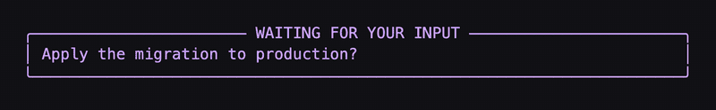

# ask-pulse

A pulsing dayglo banner that mounts directly above the omp `ask` dialog, so an agent
waiting on your input is impossible to miss in a wall of terminal panes.



<sub>Preview rendered from the same color/glyph math the extension uses; the lower box stands in for omp's own ask dialog.</sub>

## Why an extension, not a patch

The ask dialog paints its own border with the static theme token `theme.fg("border", …)`
and `AskDialogComponent` is not exported from the public component barrel — there is no
seam to animate it from outside. Patching the installed package would be erased by omp's
several releases per day. So this mounts an *adjacent* animated banner through the stable
extension API (`pi.setWidget(..., { placement: "aboveEditor" })`), which renders immediately
above the editor container the dialog lives in.

## Install

```
/marketplace add mlg87/omp-ask-pulse
/marketplace install ask-pulse@mlg87
```

Restart the session — newly installed extension modules are loaded at startup.

Or, without the marketplace, drop `src/ask-pulse.ts` into `~/.omp/agent/extensions/`.

## Configuration

No source edits — a marketplace install lives in a plugin cache that `omp plugin upgrade`
overwrites. Use the slash command:

```
/ask-pulse show                 print the active palette and where it came from
/ask-pulse color pink           preset: pink green cyan amber violet red
/ask-pulse color #39ff14        or any #rgb / #rrggbb hex
/ask-pulse period 800           pulse cycle in ms (min 100)
/ask-pulse preview              mount the banner for four seconds
/ask-pulse reset                delete the user config
```

`color` and `period` persist to `~/.omp/agent/ask-pulse.json`. Precedence, lowest to
highest:

| Source | Example |
|---|---|
| built-in default | dayglo pink `#ff10f0` @ 1200 ms |
| user config | `~/.omp/agent/ask-pulse.json` |
| project config | `<project>/.omp/ask-pulse.json` |
| environment | `ASK_PULSE_COLOR=#0af0ff ASK_PULSE_PERIOD_MS=800` |

```json
{ "color": "#ff10f0", "periodMs": 1200 }
```

The config is re-read on every ask, so a change lands on the next question — no restart.
Only the bright endpoint is configurable; the trough is derived from it at 24% brightness,
so one word recolors the whole banner. A malformed config is ignored rather than fatal.

Compile-time knobs still living in `src/ask-pulse.ts`: `FRAME_MS` (repaint tick),
`MAX_QUESTIONS`, `MAX_LINES_PER_QUESTION`.

## Degradation

- RPC/ACP modes only accept string-array widgets; every `setWidget` call is wrapped in
  try/catch and silently no-ops there.
- If `tool_execution_end` is skipped (Esc-aborted ask), `agent_end` and `session_shutdown`
  clear the banner.
- Colors are 24-bit truecolor; non-truecolor terminals approximate.
- The only runtime imports are `bun` and `node:*` builtins; every omp package import is
  type-only, so the module resolves nothing from a package tree.

## Local development

Point omp at a working copy instead of the published cache, then restart the session:

```
omp plugin link ./plugins/ask-pulse
```

```
bun install
bun run lint        # biome
bun run typecheck   # tsc --strict
bun run test        # bun test
```

`scripts/frame.html` renders one preview frame; it mirrors the color and glyph math in
`src/ask-pulse.ts` and takes the pulse phase as `?t=<elapsed ms>` (period 1200 ms). To
refresh `docs/ask-pulse.gif` after a color change, screenshot it across one period — 24
frames at 50 ms — and encode:

```
ffmpeg -framerate 20 -i f%03d.png \
  -vf "scale=800:-2:flags=lanczos,split[a][b];[a]palettegen=max_colors=64:stats_mode=diff[p];[b][p]paletteuse=dither=bayer:bayer_scale=4:diff_mode=rectangle" \
  -loop 0 docs/ask-pulse.gif
```

## License

MIT
